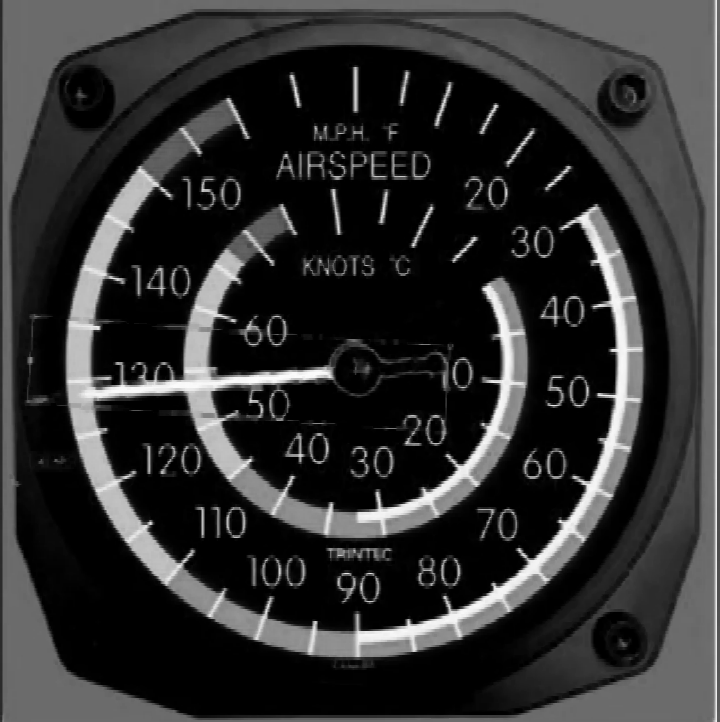
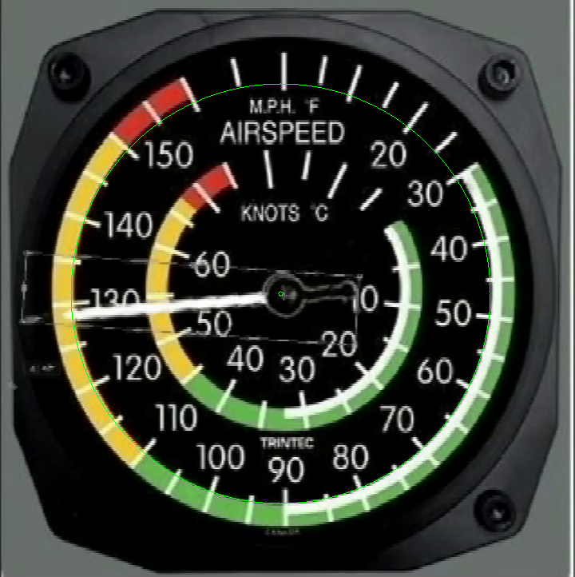
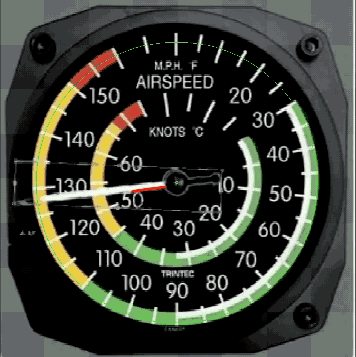
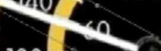
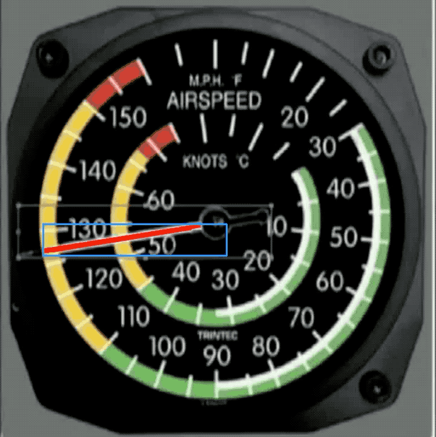

# 飞机仪表盘指针识别

**同济大学2018年SITP项目**

## 目录

* [介绍](#介绍)
* [环境](#环境)
* [数据](#数据)
* [Canny法](#Canny法)
* [机器学习&显著度](#机器学习&显著度)
* [分析](#分析)
* [TODO](#TODO)

## 介绍

本项目为 *飞机无人驾驶初步研究* 中的一部分。利用计算机视觉和机器学习等技术对仪表盘的指针进行识别。

## 环境

C++

OpenCV 3

## 数据

./video/1.mp4

## Canny法

Canny边缘检测于1986年由JOHN CANNY首次在论文《A Computational Approach to Edge Detection》中提出。

本项目直接调用OpenCV的接口进行图像处理。

### 过程

* 对图像进行预处理。

* 利用Canny，findContours寻找表盘，并找出仪表盘的中心。利用直线到圆心的距离可以筛选掉大部分干扰直线。

* 利用Hough法寻找直线，并利用圆心过滤

### 结果

## 机器学习&显著度

显著性检测就是把一幅图像中最吸引人注意的部分提取出来。显著性特征提取有很多种方法，本项目使用LC法。

### 过程

* 标注图片中指针的位置并进行训练（本项目使用[百度AI平台](http://ai.baidu.com/)训练模型并返回指针所在矩形）。
* 对图片中指针所在区域提取显著性特征，并做腐蚀处理，去除干扰Hough的噪声。

* 对显著性图像使用Hough法，寻找直线，并利用直线最短长度进行筛选。

### 结果

## 分析

Canny方法利用计算机图形学相关知识，对图片处理速度较快，但是由于不同仪表盘的情况不同，Canny，findContour，Hough等具体的参数都需要手动根据不同的仪表盘进行调节，而且识别效果不稳定。

机器学习与显著性方法利用了图像识别，计算机图形学相关知识，识别准确率相较于Canny法大大提升，如果训练的样本足够，可以迁移到不同的表盘，而且需要手动调节的参数不多，只需大概确定范围，就可以得到不错的效果。但机器学习需要大量数据进行训练，且训练时间较慢，模型对于仪表盘指针的识别也较慢。

## TODO

* 自己训练模型代替百度AI平台
* 使用YOLO法对指针进行识别
* 机器学习所返回的区域过小，可能导致显著性特征提取效果变差。尝试对整个图像计算显著性特征。